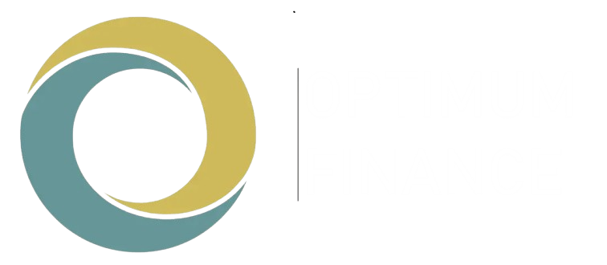
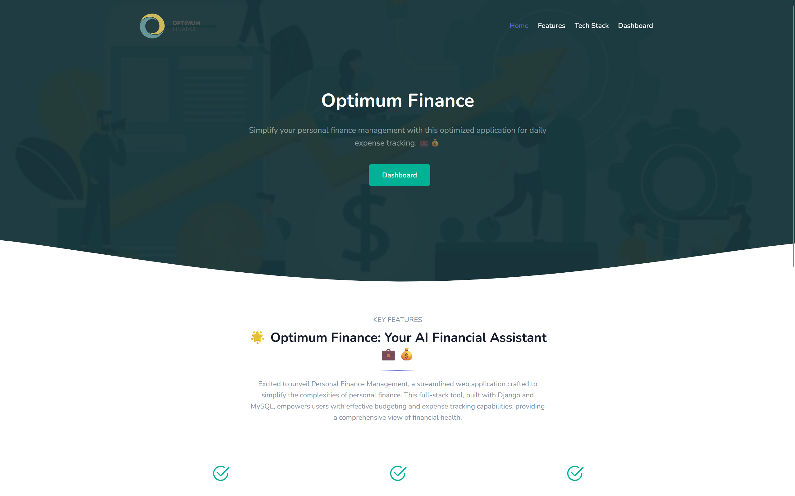

<p id="top" align="center">
  <a href="https://money-manager.me" target="_blank">
    
  </a>
</p>

<h1 align="center" class="dotted">
    <a href="https://money-manager.me" target="_blank">Money Manager</a>
</h1>

<br>

<p align="center">
  


<a href="https://github.com/vedangbandi/Optimum-Finance">

</a> 

</p>

Welcome to Optimum Finance, your digital financial assistant! Streamline personal finance easily using Django and MySQL for effective budgeting and expense tracking.


## Table Of Contents :

* [About the Project](#About-The-Project)
* [Technologies Used](#technologies-used)
* [Features](#Features)
* [Getting Started](#Getting-Started)
  * [Prerequisites](#Prerequisites)
  * [Installation](#installation)
* [Credentials](#Default-Credentials)
* [Screenshots, Demo Video](#Screenshots)
* 


## About The Project



Welcome to Optimum Finance, a streamlined web application designed to simplify personal finance management. Built with Django and MySQL, this full-stack tool empowers users with effective budgeting and expense-tracking capabilities, providing a comprehensive view of financial health.


## Technologies Used

- Backend: Python with Django framework
- Frontend: HTML, CSS, Bootstrap for a responsive and visually appealing interface
- Interactivity: JavaScript, jQuery, AJAX for seamless user experience
- Database: MySQL for data management


## Features

- User-Friendly Interface: Designed for simplicity and ease of use.
- Comprehensive Financial Management: Budget creation, expense tracking, and financial reporting in one place.
- Real-Time Insights: Instantly analyze and understand spending habits.


## Getting Started

This is an example of how you may give instructions on setting up your project locally.
To get a local copy up and running follow these simple example steps.


### Prerequisites

Install Python 3.7 or above

*  <a href="https://python.org/downloads/" target="_blank">Python</a>

### Installation

> 👉 **Step 1** - Download the code from the GH repository (using `GIT`):
```bash
git clone https://github.com/vedangbandi/Optimum-Finance.git && cd Money-Management
```

<br />

> 👉 **Step 2** - Create virtual environment:
```
python -m venv .venv
```

<br />

> 👉 **Step 3** - Activating the environment:

on Windows:
```bash
.venv\Scripts\activate.bat
```
on Mac OS / Linux:
```bash
source .venv\Scripts\activate
```

<br />

> 👉 **Step 4** - Installing dependencies:

```bash
pip install -r requirements.txt
```

<br />

> 👉 **Step 5** - Go `config.py`


Go to the `config.py` file in the Money-Management folder (`/wallet/config.py`) setting all requirements after "=". 

```
email = ''
password = ''
```

<br />

> 👉 **Step 6** - You can now run the development server:

```bash
python manage.py runserver
```

Visit [`http://127.0.0.1:8000`](http://localhost:8000) in your browser. The app should be up & running.

<br />

## Default Credentials

- **User Credentials:**
  - Username: admin
  - Password: admin@123


## Screenshots


Demo Video 👇:

https://github.com/prathmeshsoni/Money-Management/assets/78293392/36d7c633-c1f5-4a1d-8e54-15736b647b1d


<br />

The repository is a starting point for most of my professional projects; for this, I'm using it as a part of my portfolio, feel free to use it wherever you want. I'll be happy if you provide any feedback code improvements or suggestions.


## All Set :)

<p style="float:left;" align="left">
  <a href="#top">Back To Top</a>
</p>

<p style="text-align:right;" align="right">
  <a href="https://github.com/vedangbandi/Optimum-Finance" target="_blank">Back To Repository</a>
</p>


---

